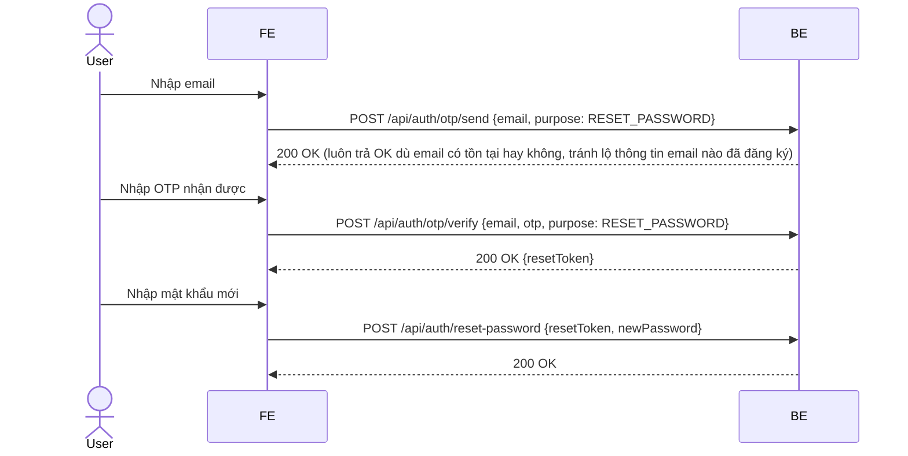
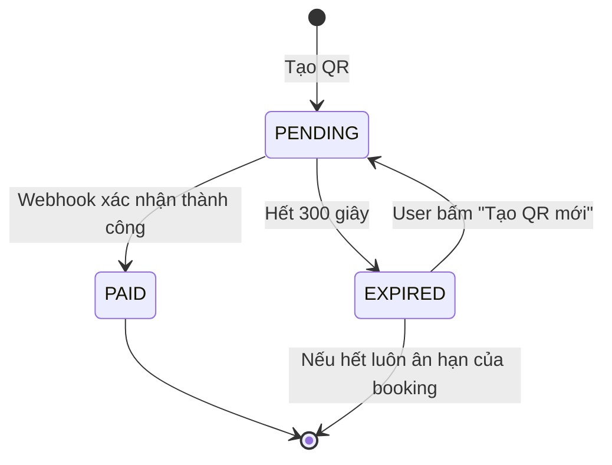

# VIETJOURNEY — FULL FEATURE & SCREEN SPECIFICATION
### Đặc tả chi tiết theo đúng 49 mục đã liệt kê (1 Home → 49 Chức năng nhỏ) + Admin (38-48)
> Dùng làm nguồn cắt nhỏ từng phần đưa cho AI coding agent (Gemini/GLM/Claude Code).

Quy ước ký hiệu quyền truy cập: 🔓 Public | 🔒 Cần đăng nhập (Customer) | 🛠️ Admin/Staff | ⚙️ System/Auto.

---

## 1. Trang chủ (Home) — 🔓

### 1.1 Hero Banner
- **Components:** Banner slideshow (autoplay, dot indicator), Banner video (autoplay muted + nút unmute), Banner quảng cáo (ảnh tĩnh có link click-through).
- **CTA:** "Đặt vé ngay" (Book Now) → cuộn tới Search Bar; "Check-in" → `/checkin`; "Tình trạng chuyến bay" (Flight Status) → `/flight-status`.
- **API:** `GET /api/cms/banners?position=hero&status=active` — trả về danh sách banner do Admin quản lý (Module 44/45).
- **Edge case:** Banner video cần fallback ảnh tĩnh nếu thiết bị/mạng yếu (giảm data mobile).

### 1.2 Thanh tìm kiếm chuyến bay
- **Loại hành trình:** One-way / Round-trip / Multi-city (tối đa gợi ý 4 chặng cho multi-city).
- **Input:** Điểm đi, Điểm đến, Ngày đi, Ngày về (ẩn nếu one-way), Số hành khách (Adult/Child/Infant), Hạng ghế.
- **Validation:**
  - VAL-01: Điểm đi ≠ Điểm đến.
  - VAL-02: Ngày về phải sau ngày đi (nếu round-trip).
  - VAL-03: Tổng số khách không vượt giới hạn (tối đa 9 người lớn+trẻ em/lần, số em bé ≤ số người lớn).
- **API:** `GET /api/flights/search` (đã đặc tả chi tiết ở tài liệu Feature Spec trước).

### 1.3 Promotion (Tour / Vé giảm giá / Flash sale / Voucher)
- **Components:** Slider ngang, Countdown timer (cho Flash sale — dùng chung logic đếm ngược với QR payment ở mục 13, có thể tái sử dụng 1 component `<Countdown seconds={} onExpire={} />`).
- **CTA:** "Xem chi tiết" → `/promotions/:id`.
- **API:** `GET /api/promotions?type=FLASH_SALE&status=active`

### 1.4 News (Tin tức / Khuyến mãi / Thông báo)
- **Components:** List card (ảnh thumbnail, tiêu đề, ngày đăng, category tag).
- **API:** `GET /api/news?category=&page=&size=`

### 1.5 Destination
- **Hiển thị:** Card điểm đến (ảnh, tên, "Giá từ ...").
- **Filter:** Domestic / International (toggle tab).
- **API:** `GET /api/destinations?scope=domestic|international`

### 1.6 Services (giới thiệu dịch vụ, không phải trang thao tác)
- Extra baggage, Seat selection, Meal, Insurance, Hotel, Car rental — mỗi cái là 1 card giới thiệu + link tới trang dịch vụ tương ứng hoặc mở popup thông tin (Hotel/Car rental có thể là **Out of Scope** giai đoạn 1, chỉ hiển thị "Sắp ra mắt" — xem ghi chú cuối file).

### 1.7 Footer
- About, Contact, Careers, Privacy, Cookie, Social media links — nội dung tĩnh, không cần API riêng (có thể lấy từ CMS config hoặc hardcode).

---

## 2. Đăng ký — 🔓

**Form:** Full name, Email, Password, Confirm password.

**Validation:**
- Email đúng định dạng, chưa tồn tại trong hệ thống (check async khi blur field).
- Password strength: tối thiểu 8 ký tự, có chữ hoa/thường/số (hiển thị thanh đo độ mạnh realtime).
- Confirm password phải khớp password.

**OTP Email:**
- Gửi OTP 6 số vào email, TTL 5 phút.
- Countdown hiển thị dạng `mm:ss` trên UI.
- Nút "Gửi lại OTP" bị disable trong 60 giây đầu, sau đó active lại (chống spam gửi OTP).

**API:**
```
POST /api/auth/register        Body: { fullName, email, password }
POST /api/auth/otp/send        Body: { email, purpose: "REGISTER" }
POST /api/auth/otp/verify      Body: { email, otp }
```

**Business Rule liên quan:** Email unique; tối đa 5 lần gửi OTP/giờ/email (rate limit).

---

## 3. Đăng nhập — 🔓

**Login bằng:** Email / Số điện thoại / Mã hội viên Loyalty (Loyalty Account number).

**Có:** "Ghi nhớ đăng nhập" (Remember me → refresh token TTL dài hơn, 30 ngày thay vì 7 ngày).

**Quên mật khẩu:** Link chuyển sang Module 4.

**Đăng nhập mạng xã hội:** Google OAuth2, Facebook OAuth2 (Authorization Code flow, redirect callback backend xử lý tạo/link user).

**API:**
```
POST /api/auth/login           Body: { identifier, password, rememberMe }
GET  /api/auth/oauth/google/callback
GET  /api/auth/oauth/facebook/callback
```

**Business Rule:** Khoá tạm tài khoản 15 phút sau 5 lần sai liên tiếp (BR-013, hiển thị thông báo còn bao nhiêu lần thử trước khi khoá).

---

## 4. Quên mật khẩu — 🔓

**Luồng 3 bước:** Nhập email → Nhập OTP → Đặt mật khẩu mới.


**Lưu ý bảo mật:** Bước gửi OTP luôn trả về `200 OK` bất kể email có tồn tại hay không, để tránh bị dò email đã đăng ký (user enumeration).

---

## 5. Hồ sơ cá nhân — 🔒

**Thông tin:** Avatar, Họ tên, Ngày sinh, Quốc tịch, CCCD, Passport (số + ngày hết hạn).

**Chức năng:** Update profile, Change password, Upload avatar (kéo-thả + crop trước khi lưu, xem Module 49).

**API:**
```
GET   /api/account/profile
PATCH /api/account/profile
POST  /api/account/change-password   Body: { oldPassword, newPassword }
POST  /api/account/avatar            (multipart/form-data)
```

**Validation:** Passport/CCCD chỉ nhập số + validate format cơ bản; ngày hết hạn Passport phải > ngày hiện tại (cảnh báo nếu sắp hết hạn trong 6 tháng, vì ảnh hưởng chuyến bay quốc tế).

---

## 6. Loyalty Account — 🔒

**Hiển thị:** Số dặm (Miles) tích luỹ, Hạng thành viên (Membership tier: Bronze/Silver/Gold), Lịch sử giao dịch điểm.

**API:**
```
GET /api/account/loyalty
GET /api/account/loyalty/transactions?page=&size=
```

**Business Rule:** Điểm cộng theo % giá trị booking `CONFIRMED`, chỉ cộng chính thức sau khi booking chuyển `COMPLETED` (tránh cộng điểm ảo rồi phải trừ lại khi huỷ vé).

---

## 7. Booking Flight — Chọn chuyến (module lớn nhất) — 🔓

**Search + Sort + Filter** (đã đặc tả kỹ ở tài liệu SRS trước, Feature 3.1/3.2). Bổ sung chi tiết còn thiếu:

- **Sort theo:** Price / Duration / Departure time / Arrival time.
- **Filter theo:** Khung giờ (Morning 00:00-12:00 / Afternoon 12:00-18:00 / Evening 18:00-24:00), Airline (multi-select), Số điểm dừng (Stops: 0/1/2+), Khoảng giá (range slider), Hạng ghế (Seat class).

**API:**
```
GET /api/flights/search?sortBy=price&filters[timeOfDay]=morning&filters[airline]=VJ,VNA&filters[stops]=0&filters[priceMin]=&filters[priceMax]=
```

---

## 8. Chọn ghế — 🔓 (optional step)

**Seat map:**
- Màu trạng thái: Available (xanh nhạt), Booked (xám, disable click), Premium (vàng/gold, phụ phí), Emergency (cam, yêu cầu điều kiện đặc biệt — ví dụ không dành cho trẻ em/người già/phụ nữ mang thai, cần checkbox xác nhận đủ điều kiện).
- **Tương tác:** Zoom in/out (pinch trên mobile, scroll wheel trên desktop), Hover hiển thị tooltip giá ghế, Click để chọn/bỏ chọn.

**Business Rule:** Ghế Emergency row bắt buộc có bước xác nhận điều kiện (checkbox "Tôi đủ 18-60 tuổi, không mang thai, có thể hỗ trợ thoát hiểm khi cần") trước khi cho chọn.

**API:**
```
GET  /api/flights/{flightId}/seat-map
POST /api/bookings/draft/{id}/seats   Body: { passengerId, seatCode }
```

---

## 9. Chọn hành lý (Extra baggage) — 🔓 (optional)

**Gói:** 5kg / 10kg / 15kg / 20kg — giá cộng dồn hiển thị realtime vào tổng tiền booking draft.

**API:**
```
PUT /api/bookings/draft/{id}/extras   Body: { extraBaggageKg: 10 }
```
**Validation:** Không cho chọn baggage vượt giới hạn tối đa cho phép của hạng vé/loại máy bay (ví dụ tối đa 40kg tổng cộng).

---

## 10. Chọn suất ăn (Meal) — 🔓 (optional)

**Danh sách:** Vegetarian, Muslim (Halal), Kid meal, Seafood, Drink (đồ uống thêm).

**API:**
```
PUT /api/bookings/draft/{id}/extras   Body: { meals: [{ passengerId, mealCode: "VGML" }] }
```
**Business Rule:** Suất ăn đặc biệt (Muslim/Vegetarian/Kid) cần đặt trước tối thiểu 24h trước giờ bay (ràng buộc catering thực tế) — nếu đặt trễ hơn, hệ thống chỉ cho chọn suất ăn tiêu chuẩn.

---

## 11. Nhập thông tin hành khách — 🔓

**Loại hành khách:** Adult / Child / Infant — mỗi loại có form field khác nhau (Infant cần thông tin "đi cùng người lớn nào", không có ghế riêng).

**Validation:**
- Passport: bắt buộc với chuyến bay quốc tế, số passport đúng định dạng theo quốc gia (tối thiểu validate độ dài/ký tự).
- Visa: bắt buộc nếu điểm đến yêu cầu visa (có thể check theo bảng cấu hình `country_visa_requirements` — nâng cao, có thể để phase 2).
- Ngày hết hạn passport: phải còn hiệu lực tối thiểu 6 tháng sau ngày về (thông lệ hàng không quốc tế) — cảnh báo rõ ràng nếu không đủ điều kiện, không chặn cứng nếu là bay nội địa.

**API:** (đã có ở Feature Spec 3.4 tài liệu trước)

---

## 12. Chọn bảo hiểm — 🔓 (optional)

**Checkbox:** Chọn 1 trong các gói Insurance package hiển thị (giá + quyền lợi tóm tắt, có link "Xem chi tiết điều khoản").

**API:**
```
PUT /api/bookings/draft/{id}/extras   Body: { insurancePackageId }
```

---

## 13. Thanh toán — Module rất lớn — 🔓

### 13.1 Credit Card (Visa/Master/JCB)
- Form nhập: Số thẻ, Tên chủ thẻ, Ngày hết hạn (MM/YY), CVV.
- **Bảo mật quan trọng:** KHÔNG BAO GIỜ lưu số thẻ/CVV trên server của VietJourney — luôn dùng iframe/SDK tokenization của cổng thanh toán (PCI-DSS compliance), backend chỉ nhận `paymentToken` từ cổng, không chạm vào dữ liệu thẻ thô.

### 13.2 QR Payment (trọng tâm — đặc tả đầy đủ)

**Quy trình:**
1. User chọn "Thanh toán QR" → Backend sinh mã QR (VietQR chuẩn hoặc qua cổng VNPay/Momo/ZaloPay QR API).
2. QR có hiệu lực **5 phút (300 giây)**, FE hiển thị countdown dạng `04:59 → 04:58 → ... → 00:00`.
3. Backend kiểm tra trạng thái theo 1 trong 2 cơ chế:
   - **Polling:** FE gọi `GET /api/payments/{transactionId}/status` mỗi **3 giây/lần**.
   - **WebSocket (khuyến nghị hơn nếu có thời gian làm):** FE subscribe channel `payment.{transactionId}`, Backend push event ngay khi nhận webhook, giảm tải server so với polling liên tục và cập nhật nhanh hơn.
4. Nếu trạng thái = `PAID` → chuyển màn hình "Payment Success" (Module 14).
5. Nếu `EXPIRED` → hiển thị "QR đã hết hạn", cho phép **sinh QR mới** (tạo transaction mới, booking vẫn giữ trạng thái `PENDING_PAYMENT` trong khoảng ân hạn ngắn trước khi tự huỷ hẳn nếu không thao tác tiếp).



**So sánh Polling vs WebSocket (để quyết định implement):**
| Tiêu chí | Polling 3s | WebSocket |
|---|---|---|
| Độ phức tạp implement | Thấp | Cao hơn (cần quản lý connection, reconnect) |
| Độ trễ cập nhật | ~0-3s | Gần như tức thời |
| Tải server khi nhiều user cùng lúc | Cao hơn (nhiều request lặp) | Thấp hơn (chỉ push khi có sự kiện) |
| Gợi ý | Làm trước (đơn giản, đủ dùng cho portfolio) | Nâng cấp sau nếu muốn thể hiện kỹ thuật real-time |

### 13.3 Banking / Ví điện tử (redirect flow)
- Internet Banking, MoMo, VNPay, ZaloPay — theo mô hình **redirect**: user được chuyển sang trang của cổng thanh toán, thao tác xong redirect quay lại `PAYMENT-RESULT` kèm tham số kết quả (nguồn sự thật cuối cùng vẫn là webhook, không phải tham số redirect — như đã nêu ở Feature "Payment Callback" tài liệu trước).

### 13.4 Apple Pay / Google Pay
- Dùng SDK tương ứng (Apple Pay JS API / Google Pay API), backend chỉ nhận payment token đã mã hoá từ SDK, không xử lý dữ liệu thẻ thô — tương tự nguyên tắc ở 13.1.

### 13.5 Lưu hoá đơn
- **Download PDF:** Sinh hoá đơn PDF (dùng thư viện dạng iText/wkhtmltopdf phía backend), gồm thông tin: mã booking, chi tiết dịch vụ, số tiền, VAT (nếu thanh toán VNĐ).
- **Email Invoice:** Tự động gửi kèm email xác nhận thanh toán thành công (đính kèm PDF).

**API tổng hợp Module 13:**
```
POST /api/payments/qr/create
GET  /api/payments/{transactionId}/status
WS   /ws/payments/{transactionId}          (nếu dùng WebSocket)
POST /api/payments/webhook
POST /api/payments/card/create             Body: { bookingId, paymentToken }
POST /api/payments/ewallet/create          Body: { bookingId, provider: "MOMO"|"VNPAY"|"ZALOPAY" }
GET  /api/bookings/{id}/invoice.pdf
```

---

## 14. Payment Success — 🔓

**Hiển thị:** Booking ID (PNR), QR Boarding pass rút gọn, danh sách Passenger, thông tin Flight, nút "Download Ticket" (PDF), nút "Print".

**API:** `GET /api/bookings/{pnr}/e-ticket`

---

## 15. Payment Failed — 🔓

**Hiển thị:** Lý do thất bại (thẻ bị từ chối/QR hết hạn/huỷ giao dịch).

**Hành động:** "Retry" (thử lại cùng phương thức, tạo transaction mới nếu còn trong thời gian ân hạn của booking), "Change payment method" (quay lại Module 13 chọn phương thức khác, booking draft vẫn giữ nguyên nếu chưa hết hạn hoàn toàn).

---

## 16. Booking History — 🔒

**Danh sách booking** của Customer đang đăng nhập.

**Filter:** Theo khoảng ngày (ngày khởi hành), Theo trạng thái (Upcoming/Completed/Cancelled), Search theo mã booking.

**API:** `GET /api/account/bookings?status=&fromDate=&toDate=&bookingCode=&page=&size=`

---

## 17. Manage Booking — 🔓🔒

**Input:** Booking Code (PNR) + Last Name (cho Guest tra cứu; Member vào từ Module 16 không cần nhập lại).

**Cho phép:**
- Đổi ngày bay (subject to fare rules + phí đổi theo BR-014).
- Đổi ghế.
- Thêm hành lý (mua thêm sau khi đã xác nhận booking).
- Huỷ vé (tính phí hoàn theo BR-014, hiển thị rõ số tiền hoàn dự kiến trước khi user xác nhận).

**API:**
```
GET  /api/bookings/lookup?pnr=&lastName=
POST /api/bookings/{id}/change-date
POST /api/bookings/{id}/change-seat
POST /api/bookings/{id}/add-baggage
POST /api/bookings/{id}/cancel
```

---

## 18. Flight Status — 🔓

**Tra cứu theo:** Flight Number, hoặc theo cặp Departure + Arrival + ngày.

**Hiển thị:** Trạng thái (On Time / Delayed / Cancelled), Gate, Terminal, giờ dự kiến vs giờ thực tế.

**API:** `GET /api/flights/status?flightNumber=` hoặc `?origin=&destination=&date=`

**Notification liên quan:** Nếu chuyến bay Delayed/Cancelled và user có booking liên quan → tự động trigger Module 37 (Notification Email: Flight Delay).

---

## 19. Online Check-in — 🔓🔒

**Điền:** Booking code + Last name (Guest), hoặc tự động load nếu đã đăng nhập và vào từ Booking History.

**Luồng:** Chọn/xác nhận ghế (nếu chưa chọn từ trước) → Check-in → Xuất Boarding Pass.

**Business Rule:** Chỉ mở check-in trong khung giờ quy định (ví dụ 24h đến 1h trước giờ bay), ngoài khung giờ này disable nút Check-in kèm thông báo thời gian mở/đóng.

**API:**
```
POST /api/checkin   Body: { pnr, lastName, seatCode? }
```

---

## 20. Boarding Pass — 🔓🔒

**Components:** QR Code (chứa mã PNR + thông tin chuyến bay để quét tại cổng), Download PDF, Add to Apple Wallet, Add to Google Wallet (dùng chuẩn `.pkpass` cho Apple, Google Wallet API cho Android).

---

## 21. Destination — 🔓

**Danh sách điểm đến**, Search theo tên, Filter (Domestic/International/theo châu lục), **Map** (hiển thị bản đồ với marker các điểm đến, dùng Google Maps hoặc Mapbox).

**API:** `GET /api/destinations?search=&region=`

---

## 22. Tour Detail — 🔓

**Components:** Ảnh (gallery), Giá (theo loại phòng/số khách), Lịch trình (itinerary theo ngày), Gallery ảnh thực tế, Review (rating + comment từ khách đã đi — điều kiện đã nêu ở BR-015), nút "Book Tour".

**API:** `GET /api/tours/{id}`

---

## 23. Promotion Detail — 🔓

**Thông tin:** Mô tả khuyến mãi, Điều kiện áp dụng (giá trị đơn tối thiểu, sản phẩm áp dụng, thời hạn), nút "Áp dụng ngay" → điều hướng sang Search với voucher code tự động điền sẵn.

**API:** `GET /api/promotions/{id}`

---

## 24. News — 🔓

**Danh sách:** Category filter, Search, Pagination.

**API:** `GET /api/news?category=&search=&page=&size=`

---

## 25. News Detail — 🔓

**Components:** Nội dung bài viết, Related posts (gợi ý theo category), Share (Facebook/X/Zalo — xem Module 49).

**API:** `GET /api/news/{slug}`

---

## 26. Contact — 🔓

**Form:** Name, Email, Subject, Content, Upload file (đính kèm — giới hạn dung lượng, loại file cho phép).

**API:** `POST /api/contact` — lưu vào bảng `contact_messages`, gửi notification cho Support role xử lý.

---

## 27. FAQ — 🔓

**Components:** Accordion (câu hỏi/trả lời expand-collapse), Search trong FAQ, Filter theo Category (Booking/Payment/Check-in/Refund...).

**API:** `GET /api/faq?category=&search=`

---

## 28. Feedback — 🔒 (viết), 🔓 (xem)

**Đánh giá theo đối tượng:** Chuyến bay (Flight), Sân bay (Airport), Dịch vụ (Service), Điểm đến (Destination), Tour.

**Components:** Rating sao (★★★★★, 1-5), Comment, Upload ảnh, Upload video (giới hạn dung lượng/thời lượng).

**Chức năng:**
- Admin reply (Support/Admin trả lời công khai dưới feedback).
- Edit feedback (chỉ user chủ sở hữu, trong khoảng thời gian cho phép, ví dụ 24h sau khi đăng — sau đó khoá edit để tránh sửa đổi bất thường).
- Delete feedback (user tự xoá feedback của mình, hoặc Admin xoá nếu vi phạm).
- Like feedback (đánh dấu hữu ích, tăng độ tin cậy hiển thị).
- Report feedback (báo cáo nội dung không phù hợp, đẩy vào hàng đợi Admin duyệt).

**Business Rule:** Chỉ viết được khi booking liên quan ở trạng thái `COMPLETED` (BR-015); mặc định `PENDING_REVIEW` chờ duyệt (BR-016).

**API:**
```
POST   /api/reviews
GET    /api/reviews?targetType=&targetId=&sortBy=helpful|recent
PATCH  /api/reviews/{id}          (user tự sửa, trong hạn cho phép)
DELETE /api/reviews/{id}
POST   /api/reviews/{id}/like
POST   /api/reviews/{id}/report
POST   /api/reviews/{id}/reply    (role Admin/Support)
```

---

## 29. Notification — 🔒

**Components:** Bell icon (badge số lượng chưa đọc), dropdown/danh sách thông báo.

**Loại:** Promotion, Booking, Payment, Check-in reminder.

**API:**
```
GET   /api/account/notifications?page=&size=
PATCH /api/account/notifications/{id}/read
PATCH /api/account/notifications/read-all
```

---

## 30. Wishlist — 🔒

**Lưu:** Tour, Destination, Promotion (bookmark để xem lại sau).

**API:**
```
POST   /api/account/wishlist        Body: { targetType, targetId }
DELETE /api/account/wishlist/{id}
GET    /api/account/wishlist
```

---

## 31. Chat Support — 🔓🔒

**Components:** Chatbot (trả lời tự động dựa trên FAQ — có thể dùng rule-based đơn giản trước, AI/LLM sau nếu muốn nâng cao), Live chat (kết nối với Support role qua WebSocket), FAQ AI (gợi ý câu trả lời từ knowledge base FAQ).

**Lưu ý phạm vi:** Đây là tính năng phức tạp, gợi ý xếp vào **Volume 14 Roadmap** nếu thời gian hạn chế — có thể làm bản đơn giản (link tới FAQ + form Contact) trước, nâng cấp chatbot/live chat thật sau.

---

## 32. Language — 🔓🔒

**Dropdown:** EN / VN / JP / KR / CN (mở rộng tuỳ nhu cầu thực tế — gợi ý bắt đầu chỉ với VI/EN cho portfolio, thêm ngôn ngữ khác là "nice to have").

**Đổi ngôn ngữ realtime:** Không reload trang, dùng i18next (hoặc tương đương), lưu lựa chọn vào `localStorage` + đồng bộ lên server nếu đã đăng nhập (bảng `user_preferences`).

---

## 33. Currency — 🔓🔒

**Đơn vị:** USD / VND / JPY / EUR.

**Hiển thị giá tương ứng:** Giá gốc lưu VNĐ trong DB, hiển thị FE convert theo tỷ giá cấu hình (Admin cập nhật tỷ giá thủ công định kỳ — vì đây không phải sàn giao dịch tài chính real-time, tỷ giá cố định theo ngày là đủ).

**Business Rule liên quan (tương tự VNA thật):** Chỉ hiển thị đổi tiền tệ tham khảo; giao dịch thanh toán thực tế chỉ chạy bằng VNĐ trong phạm vi dự án (tương tự lưu ý MCP đã nêu ở tài liệu trước) — trừ khi bạn quyết định làm đầy đủ multi-currency payment thật.

---

## 34. Theme — 🔓🔒

**Light / Dark / System Theme** (tự động theo `prefers-color-scheme` của OS).

**Lưu vào LocalStorage**, đồng bộ server nếu đã đăng nhập (tuỳ chọn nâng cao).

---

## 35. Accessibility — 🔓🔒

**Font Size:** Cho phép user tăng/giảm cỡ chữ toàn site (A-/A/A+), lưu preference.

**High Contrast:** Theme tương phản cao riêng cho người khiếm thị nhẹ.

**Screen Reader:** Đảm bảo aria-label đầy đủ, alt text ảnh, thứ tự tab hợp lý, landmark roles (`<nav>`, `<main>`, `<header>`).

---

## 36. Search (Global Search) — 🔓

**Tìm kiếm hợp nhất:** Flight, News, Destination, Promotion trong 1 ô search duy nhất ở Header, kết quả nhóm theo loại.

**API:** `GET /api/search?q=&types=flight,news,destination,promotion`

**Kỹ thuật liên quan (xem Module 49):** Debounce input 300-500ms trước khi gọi API, hiển thị autocomplete dropdown.

---

## 37. Notification Email — ⚙️

**Trigger events:** Booking Success, Payment Success, Reminder (nhắc trước ngày bay/tour), Flight Delay, Check-in Reminder (mở check-in), OTP (đăng ký/quên mật khẩu/2FA).

**Thiết kế:** Mỗi loại email có 1 template riêng (HTML email, dùng thư viện template engine như Thymeleaf/Freemarker phía backend hoặc MJML để build responsive email).

**Kỹ thuật:** Gửi qua queue (RabbitMQ) để không block luồng chính khi SMTP chậm/lỗi, có retry tối đa 3 lần nếu gửi thất bại.

---

# PHẦN ADMIN / BACKOFFICE (Module 38-48) — 🛠️

## 38. Admin Dashboard

**Components:** Card tổng quan (Revenue hôm nay/tháng, Số booking mới, Số user mới), Chart (đường/cột) doanh thu theo thời gian, danh sách Feedback mới cần duyệt.

**API:** `GET /api/admin/dashboard/summary?range=today|week|month`

## 39. User Management

**CRUD User**, gán Role, cấu hình Permission chi tiết (nếu làm RBAC động thay vì role cố định), Lock account (khoá tạm/vĩnh viễn kèm lý do).

**API:**
```
GET/POST/PUT/DELETE /api/admin/users
PATCH /api/admin/users/{id}/lock
PATCH /api/admin/users/{id}/role
```

## 40. Flight Management

**CRUD Flight**, quản lý Aircraft (loại máy bay, sơ đồ ghế mẫu), Price (theo hạng vé), Time (giờ bay), Gate/Terminal.

## 41. Booking Management (Admin)

**CRUD Booking** (chủ yếu Read + cập nhật trạng thái), xử lý **Refund**, **Cancel** thay khách hàng (khi có yêu cầu qua Contact/Support), **Approve** các yêu cầu đổi vé đặc biệt (ngoài chính sách tự động).

## 42. Payment Management

**Danh sách giao dịch** (filter theo trạng thái/phương thức/khoảng ngày), xử lý **Refund** thủ công (đối với case `AMOUNT_MISMATCH` cần xử lý tay — đã nêu ở Exception Flow Payment QR), **Export Excel** danh sách giao dịch phục vụ đối soát kế toán.

## 43. Tour Management

**CRUD Tour**, quản lý Gallery ảnh, Schedule (các đợt khởi hành - `tour_departures`), Price theo đợt/loại phòng.

## 44. News Management

**CRUD News**, Rich Text Editor (WYSIWYG — vd TinyMCE/Quill), Upload ảnh kèm bài viết (drag & drop, xem Module 49).

## 45. Promotion Management

**CRUD Promotion**, quản lý Coupon/Voucher (mã code, điều kiện, thời hạn, giới hạn lượt dùng), Flash Sale (giá đặc biệt trong khung giờ cố định, cần cron job tự động bật/tắt).

## 46. Feedback Management

**Xem** danh sách feedback (bao gồm cả bị report), **Ẩn** (chuyển status REJECTED/HIDDEN), **Xoá**, **Trả lời** công khai (liên kết Module 28).

## 47. Analytics

**Biểu đồ:** Doanh thu (theo ngày/tháng/loại sản phẩm), Khách (user mới/quay lại), Top tuyến bay, Top tour, Top quốc gia/điểm đến được đặt nhiều nhất.

**API:** `GET /api/admin/analytics/revenue?groupBy=day|month&productType=`

## 48. Logging

**Các loại log:** Login Log, Payment Log, Booking Log, Error Log, Audit Log (ai làm gì, khi nào, trên đối tượng nào — đặc biệt quan trọng cho các hành động nhạy cảm: refund, huỷ booking, duyệt/từ chối review, khoá tài khoản).

**Lưu ý kỹ thuật:** Log Payment/Booking/Audit nên lưu **riêng bảng** (không chung với application log thông thường) để dễ truy vấn phục vụ đối soát và điều tra khi có tranh chấp.

---

## 49. Các chức năng nhỏ nhưng rất quan trọng (Cross-cutting features)

Nhóm này không phải 1 trang riêng mà là các **behavior xuyên suốt toàn hệ thống** — cần liệt kê rõ để AI agent implement nhất quán ở mọi màn hình liên quan, tránh làm chỗ có chỗ không.

| # | Chức năng | Áp dụng ở đâu / Ghi chú kỹ thuật |
|---|---|---|
| 1 | Dark Mode / Light Mode | Toàn site, CSS variables + `data-theme`, lưu localStorage (Module 34) |
| 2 | Chuyển ngôn ngữ | Toàn site, i18next, lưu localStorage (Module 32) |
| 3 | Chuyển đơn vị tiền tệ | Mọi nơi hiển thị giá (Module 33) |
| 4 | Breadcrumb | Tour Detail, News Detail, Booking flow (hiển thị bước 1/2/3/4) |
| 5 | Nút Back to Top | Các trang list dài (News, Destination, Tour list) |
| 6 | Skeleton loading | Flight Result, Tour List, News List, Booking History khi đang fetch data |
| 7 | Lazy loading hình ảnh | Mọi ảnh trong list/gallery (dùng `loading="lazy"` hoặc IntersectionObserver) |
| 8 | Infinite scroll / phân trang | News, Tour list, Destination, Booking History — chọn 1 kiểu nhất quán, khuyến nghị phân trang cho các trang cần filter phức tạp, infinite scroll cho feed dạng khám phá |
| 9 | Toast thông báo | Mọi action thành công/thất bại (đặt vé, thanh toán, lưu hồ sơ...) |
| 10 | Modal xác nhận thao tác | Huỷ vé, Xoá feedback, Xoá hành khách đã lưu, Logout |
| 11 | Tooltip hướng dẫn | Seat map (loại ghế), các trường form phức tạp (Passport, Visa) |
| 12 | Dropdown đa cấp | Menu Header (Chuyến bay > Nội địa/Quốc tế), Filter category |
| 13 | Bộ lọc và sắp xếp danh sách | Flight Result, Tour List, News, Feedback |
| 14 | Tìm kiếm có gợi ý (autocomplete) | Ô nhập Điểm đi/đến, Global Search (Module 36) |
| 15 | Debounce khi tìm kiếm | Global Search, autocomplete điểm đến — 300-500ms |
| 16 | Lưu lịch sử tìm kiếm | Customer đã đăng nhập — bảng `search_history`, hiển thị gợi ý "Tìm kiếm gần đây" |
| 17 | Lưu bộ lọc gần nhất | localStorage cho Guest, đồng bộ server cho Customer |
| 18 | Responsive mobile/tablet/desktop | Toàn site — breakpoint chuẩn 640px/1024px |
| 19 | PWA cơ bản | Service Worker cache static asset, manifest.json, có thể "Add to Home Screen" |
| 20 | SEO metadata | Title, description, Open Graph cho Tour Detail, News Detail, Destination |
| 21 | Chia sẻ Facebook/X/Zalo | News Detail, Tour Detail — dùng share intent URL chuẩn của từng nền tảng |
| 22 | Sao chép mã đặt chỗ | Nút copy-to-clipboard cạnh PNR ở Booking History, Payment Success |
| 23 | In vé trực tiếp | `window.print()` với CSS `@media print` riêng cho trang E-ticket/Boarding Pass |
| 24 | Xuất hoá đơn PDF | Đã nêu ở Module 13.5 |
| 25 | Upload ảnh kéo-thả (drag & drop) | Avatar, Feedback (ảnh/video), News Management (Admin) |
| 26 | Cắt và xem trước ảnh đại diện | Upload Avatar — dùng thư viện crop client-side (vd `react-easy-crop`) trước khi gửi lên server |
| 27 | Đổi mật khẩu | Module 5 |
| 28 | Xác thực hai bước (2FA) qua OTP | Tuỳ chọn bật thêm cho login (gửi OTP sau khi nhập đúng mật khẩu, trước khi cấp token) — gợi ý làm phase 2, không bắt buộc phase 1 |
| 29 | Tự động đăng xuất khi hết phiên | Access token hết hạn (15p) → tự động gọi refresh; nếu refresh token cũng hết hạn → redirect về Login kèm thông báo "Phiên đăng nhập đã hết hạn" |
| 30 | Đồng hồ đếm ngược OTP + QR | Component `<Countdown>` dùng chung cho Module 2 (OTP) và Module 13 (QR 5 phút) |
| 31 | Polling/WebSocket cập nhật thanh toán | Module 13.2 |
| 32 | Retry khi lỗi mạng | Toàn bộ API call quan trọng (thanh toán, đặt chỗ) nên có retry tự động 1-2 lần với exponential backoff trước khi báo lỗi cho user |
| 33 | Lưu bản nháp biểu mẫu | Form Passenger Information dài (nhiều hành khách) — auto-save vào localStorage để tránh mất dữ liệu nếu lỡ refresh trang |
| 34 | Đánh giá bằng sao (1-5) | Module 28 |
| 35 | Bình luận/chỉnh sửa/xoá phản hồi của chính mình | Module 28 |
| 36 | Wishlist tour/điểm đến | Module 30 |
| 37 | Theo dõi trạng thái chuyến bay real-time | Module 18 — có thể dùng polling định kỳ hoặc WebSocket nếu muốn nâng cao |
| 38 | Xuất dữ liệu Admin sang Excel/CSV | Module 42, có thể mở rộng cho User/Booking Management |
| 39 | Phân quyền (Admin/Staff/Customer) | Xuyên suốt toàn hệ thống — RBAC (xem Volume 10 Security ở tài liệu SRS trước) |
| 40 | Audit Log | Module 48 |
| 41 | CAPTCHA login/đăng ký | Module 2, 3 — kích hoạt khi phát hiện nhiều lần thử bất thường (không nhất thiết bật mặc định mọi lúc, tránh làm phiền user thật) |
| 42 | Giới hạn OTP/đăng nhập thất bại (rate limiting) | Áp dụng Redis sliding window — đã nêu ở Volume 8.7/10 tài liệu SRS trước |

---

## GHI CHÚ VỀ QUY MÔ DỰ ÁN

Với đầy đủ 49 mục trên (kể cả Admin và cross-cutting), quy mô tương đương một hệ thống OTA hoàn chỉnh: ước tính khoảng 45-60 màn hình giao diện, 120-180 API endpoint, 80-120 bảng dữ liệu (tuỳ mức chuẩn hoá), 200-300 chức năng nghiệp vụ tính cả chức năng nhỏ ở Module 49.

**Gợi ý thực tế khi làm một mình / làm dần theo sprint (ưu tiên theo giá trị portfolio + độ khó kỹ thuật):**

1. **Sprint lõi (bắt buộc để có 1 luồng chạy được đầu-cuối):** Module 1 (rút gọn), 2, 3, 7, 11, 13.2 (QR payment), 14, 15, 16, 17.
2. **Sprint mở rộng nghiệp vụ:** Module 8, 9, 10, 12, 18, 19, 20, 22, 28 (Feedback).
3. **Sprint UX/chất lượng (dễ demo, không quá khó):** Module 32, 33, 34, 35, 49 (chọn lọc các mục dễ làm trước: toast, skeleton, dark mode, i18n, breadcrumb).
4. **Sprint Admin tối thiểu (đủ để demo có backoffice, không cần làm hết 38-48):** 38 (Dashboard rút gọn), 40, 41, 45, 46.
5. **Sprint nâng cao (nếu còn thời gian, giá trị cộng điểm cao khi phỏng vấn):** WebSocket cho Module 13.2, 2FA (Module 49.28), PWA (49.19), Analytics chi tiết (Module 47), Chat Support (Module 31).

Khi đưa từng mục trong tài liệu này cho AI agent, nên copy nguyên phần tương ứng (ví dụ toàn bộ Module 13.2) kèm Business Rule liên quan đã có ở tài liệu SRS trước, thay vì đưa cả file — để agent tập trung đúng phạm vi và không bỏ sót chi tiết nghiệp vụ (đặc biệt phần xác thực webhook, idempotency, và race condition giữ ghế/slot).
