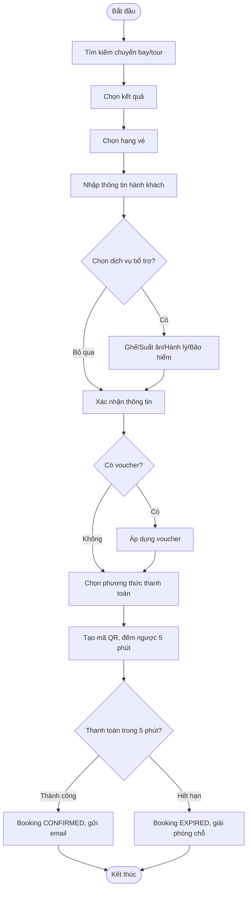
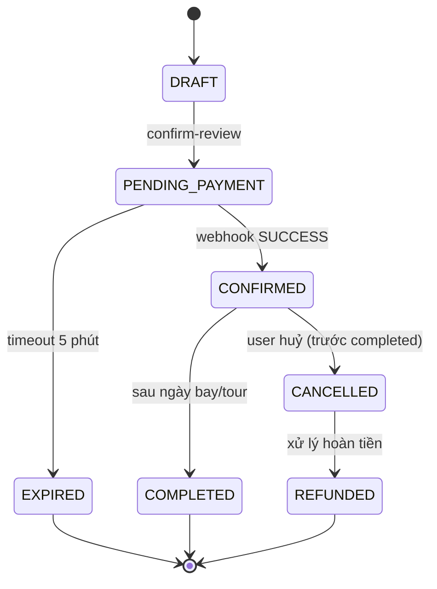
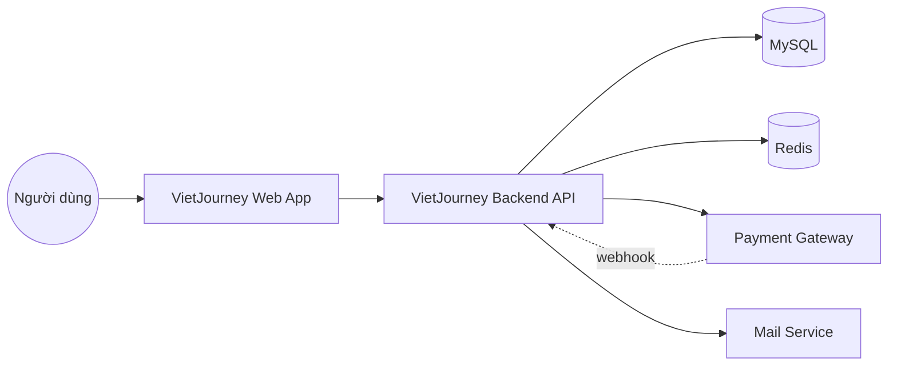

# VIETJOURNEY — SOFTWARE REQUIREMENTS SPECIFICATION (SRS)
### Full 14-Volume BA/SA Document — dùng làm nguồn prompt cho AI coding agent

Ngăn xếp công nghệ giả định: React + TypeScript + Vite (FE), Spring Boot (BE), MySQL (DB chính), Redis (cache/lock/OTP), tuỳ chọn RabbitMQ (queue thông báo/webhook retry).

---

# VOLUME 1 — VISION & BUSINESS

## 1.1. Project Overview

### Project Background
VietJourney là hệ thống đặt vé máy bay và tour du lịch trực tuyến, xây dựng theo mô hình OTA (Online Travel Agency) thu nhỏ, lấy cảm hứng quy trình nghiệp vụ từ Vietnam Airlines nhưng mở rộng thêm mảng Tour. Ban đầu là static site học tập, sau nâng cấp thành full-stack.

### Business Problem
- Người dùng phải qua nhiều app/kênh khác nhau để tìm chuyến bay và tour riêng lẻ, không có nền tảng hợp nhất quy mô nhỏ để học/thực hành.
- Cần một hệ thống minh hoạ đầy đủ vòng đời đặt chỗ — thanh toán — quản lý — đánh giá, đúng chuẩn nghiệp vụ OTA thực tế, phục vụ mục tiêu portfolio/phỏng vấn.

### Business Objectives
- BO-01: Cho phép người dùng tìm kiếm, đặt và thanh toán vé máy bay/tour trong một luồng liền mạch.
- BO-02: Đảm bảo tính toàn vẹn dữ liệu đặt chỗ (không double-booking, không giữ chỗ ảo).
- BO-03: Hỗ trợ thanh toán QR với thời hạn xác định (5 phút) và xác nhận qua webhook.
- BO-04: Cho phép khách hàng tự quản lý booking (đổi/huỷ/hoàn) mà không cần liên hệ tổng đài.
- BO-05: Thu thập đánh giá thực (chỉ từ khách đã hoàn thành chuyến đi) để tăng độ tin cậy.

### Scope
Đặt vé máy bay một chiều/khứ hồi/nhiều chặng; đặt tour trọn gói; thanh toán QR/thẻ/ví; quản lý tài khoản; đánh giá; đa ngôn ngữ VI/EN; dark/light theme; trang quản trị (Admin CMS) cơ bản.

### Out of Scope
- Tích hợp GDS thật (Amadeus/Sabre) — dùng dữ liệu chuyến bay mô phỏng trong DB nội bộ.
- Thanh toán quốc tế đa tiền tệ thật (MCP) — chỉ mô phỏng VNĐ.
- Ứng dụng di động native (chỉ web responsive).
- Chatbot/AI recommendation (đưa vào Roadmap, Volume 14).

### Stakeholders
| Vai trò | Mô tả |
|---|---|
| Product Owner (chính là bạn) | Định hướng nghiệp vụ, duyệt spec |
| AI Coding Agent (Gemini/GLM/Claude Code) | Thực thi code theo spec |
| Claude (BA/Reviewer) | Viết prompt, review code, verify độc lập |
| End User (Guest/Customer) | Người dùng cuối |
| Payment Gateway (mô phỏng) | Đối tác xử lý thanh toán QR |

### Glossary
| Thuật ngữ | Giải thích |
|---|---|
| PNR | Passenger Name Record — mã đặt chỗ |
| OTA | Online Travel Agency |
| TTL | Time To Live — thời gian sống của 1 resource (vd giữ chỗ, QR) |
| Idempotency Key | Khoá đảm bảo 1 request không bị xử lý lặp |
| Webhook | Callback HTTP từ bên thứ 3 báo kết quả xử lý bất đồng bộ |

### References
Quy trình nghiệp vụ tham khảo từ luồng đặt vé công khai của Vietnam Airlines (tìm kiếm → chọn chuyến → nhập hành khách → dịch vụ bổ trợ → thanh toán → e-ticket) và các cổng thanh toán QR phổ biến tại Việt Nam (VNPay/Momo/VietQR).

---

## 1.2. Business Analysis

### Current Process (AS-IS)
Người dùng phải vào nhiều nền tảng riêng biệt (web hãng bay, app OTA tour) để tìm và đặt, thanh toán thủ công qua chuyển khoản, không có cơ chế giữ chỗ tạm thời rõ ràng, dễ xảy ra tình trạng đặt trùng.

### Future Process (TO-BE)
Một nền tảng duy nhất: tìm kiếm hợp nhất chuyến bay + tour → giữ chỗ tạm (soft-hold) có TTL → thanh toán QR real-time có xác nhận qua webhook → tự động xác nhận/giải phóng chỗ → tự phục vụ quản lý đặt chỗ.

### Business Rules
Xem chi tiết đầy đủ tại **Volume 5**.

### Business Constraints
- Ngân sách/thời gian: dự án cá nhân, không có ngân sách mua license cổng thanh toán thật → dùng sandbox/mock.
- Hạ tầng: triển khai trên môi trường free-tier/VPS nhỏ → cần tối ưu query và cache.

### Assumptions
- Dữ liệu chuyến bay/tour được nhập sẵn (seed data), không tích hợp GDS thật.
- Tỷ giá và phí giao dịch cố định, không thay đổi real-time.

### Risks
| Risk | Mức độ | Giải pháp giảm thiểu |
|---|---|---|
| Race condition khi 2 người đặt cùng 1 ghế/slot cuối | Cao | Optimistic locking (`@Version`) + Redis distributed lock |
| Webhook giả mạo (fake payment success) | Cao | Xác thực chữ ký HMAC, whitelist IP nếu có |
| QR hết hạn nhưng FE không cập nhật kịp | Trung bình | Polling + fallback kiểm tra lại khi FE load lại trang |
| Agent tự báo cáo hoàn thành sai | Trung bình | Luôn verify bằng lệnh build/test thật, không tin báo cáo tự nhận |

---

## 1.3. Requirement Analysis

### Functional Requirements (trích, đầy đủ hơn theo module ở Volume 3)
| Mã | Mô tả |
|---|---|
| FR-001 | Hệ thống phải cho phép Guest tìm kiếm chuyến bay theo điểm đi/đến/ngày/số khách |
| FR-002 | Hệ thống phải cho phép Guest tìm kiếm Tour theo điểm đến/ngày/mức giá |
| FR-003 | Hệ thống phải cho phép đặt chỗ tạm (soft-hold) trong tối đa 5 phút chờ thanh toán QR |
| FR-004 | Hệ thống phải xác nhận thanh toán qua webhook, không dựa vào client báo cáo |
| FR-005 | Hệ thống phải cho phép Customer tự đổi/huỷ booking theo chính sách |
| FR-006 | Hệ thống chỉ cho phép viết đánh giá khi booking ở trạng thái COMPLETED |
| FR-007 | Hệ thống phải hỗ trợ chuyển đổi giao diện Light/Dark không cần đăng nhập |
| FR-008 | Hệ thống phải hỗ trợ chuyển đổi ngôn ngữ VI/EN |
| FR-009 | Hệ thống phải gửi email xác nhận đặt chỗ + vé điện tử sau khi thanh toán thành công |
| FR-010 | Admin phải có khả năng duyệt/từ chối đánh giá trước khi công khai |

### Non-functional Requirements

**Performance**
- Trang kết quả tìm kiếm phải trả về trong < 1.5s với tải trung bình (P95).
- API tạo QR thanh toán phải phản hồi trong < 800ms.

**Security**
- Mật khẩu hash bằng BCrypt (cost ≥ 10).
- JWT access token TTL ngắn (15 phút), refresh token lưu httpOnly cookie, TTL dài hơn (7 ngày), có cơ chế rotate.
- Webhook thanh toán bắt buộc xác thực chữ ký.
- Rate limit cho endpoint đăng nhập, quên mật khẩu, tạo QR (chống spam/brute-force).

**SEO**
- Server-side rendering hoặc pre-render cho trang chi tiết Tour/chuyến bay/bài viết để index tốt.
- Meta tag, sitemap.xml, robots.txt chuẩn.

**Accessibility**
- Tuân thủ WCAG 2.1 mức AA cơ bản: contrast màu đủ ở cả 2 theme, alt text cho ảnh, focus visible, hỗ trợ điều hướng bàn phím.

**Scalability**
- Thiết kế stateless cho BE (session lưu ở Redis/JWT) để có thể scale horizontal sau này.

**Availability**
- Mục tiêu uptime hợp lý cho dự án cá nhân (không SLA doanh nghiệp), nhưng có health-check endpoint.

**Monitoring**
- Log tập trung cho các luồng quan trọng: thanh toán, đặt chỗ, lỗi 5xx.

**Audit**
- Ghi log audit trail cho các hành động nhạy cảm: huỷ booking, hoàn tiền, admin duyệt review, đổi trạng thái đơn.

**Compliance**
- Tuân thủ quy định xuất hoá đơn VAT điện tử cho giao dịch VNĐ (theo mô phỏng), chính sách bảo vệ dữ liệu cá nhân cơ bản (không lưu số thẻ thật, không log dữ liệu nhạy cảm).

---

## 1.4. User Roles

| Role | Mô tả |
|---|---|
| Guest | Chưa đăng nhập, có thể tìm kiếm, đặt chỗ, thanh toán, tra cứu bằng PNR |
| Customer | Đã đăng nhập, có thêm: lưu hành khách, lịch sử booking, viết review, ví, loyalty |
| Support | Nhân viên hỗ trợ, xem/xử lý ticket, hỗ trợ đổi/hoàn vé thủ công |
| Operator | Vận hành nội dung: quản lý chuyến bay/tour, khuyến mãi, tin tức |
| Admin | Quản lý người dùng, duyệt review, cấu hình hệ thống |
| Super Admin | Toàn quyền, quản lý role/permission, cấu hình bảo mật |
| System | Tác nhân tự động: cron job hết hạn QR, gửi email, tính điểm loyalty |
| Payment Gateway | Đối tác ngoài gửi webhook xác nhận thanh toán |
| Mail Service | Dịch vụ gửi email (SMTP/SES) |

---

# VOLUME 2 — PRODUCT STRUCTURE

## 2.1. Information Architecture

### Sitemap
Xem chi tiết đầy đủ (50 trang) đã liệt kê ở tài liệu trước (`VietJourney_Spec_VNA_Clone.md`, mục 1). Ở tài liệu này ta chuyển sang tiếp cận theo **Feature** thay vì theo **Page**, như ghi chú ở cuối tài liệu.

### Navigation
- Header: Logo, menu (Chuyến bay | Tour | Khuyến mãi | Tin tức), search bar thu gọn, chọn ngôn ngữ, chọn theme, avatar/login.
- Sidebar (chỉ ở Member Area): Hồ sơ, Vé của tôi, Ví, Loyalty, Wishlist, Đánh giá của tôi, Thông báo, Cài đặt.

### Breadcrumb
Áp dụng cho: Tour detail (`Trang chủ / Tour / [Điểm đến] / [Tên tour]`), News detail, Booking flow (hiển thị bước 1/2/3/4).

### Menu
Menu chính (public) và Menu tài khoản (dropdown khi hover avatar).

### Footer
Về chúng tôi, Điều khoản, Chính sách bảo mật, Liên hệ, Social links, Đăng ký nhận tin.

### Header
Sticky header, thu gọn khi scroll, giữ nguyên nút search.

### Search
Global search box ở Header cho phép gõ nhanh điểm đến → gợi ý autocomplete (chuyến bay + tour trộn kết quả).

## 2.2. Screen Inventory

| Mã màn hình | Tên |
|---|---|
| HOME-001 | Trang chủ |
| SEARCH-FLIGHT-001 | Tìm kiếm chuyến bay |
| FLIGHT-RESULT-001 | Kết quả chuyến bay |
| TOUR-LIST-001 | Danh sách Tour |
| TOUR-DETAIL-001 | Chi tiết Tour |
| LOGIN-001 | Đăng nhập |
| REGISTER-001 | Đăng ký |
| FORGOT-PW-001 | Quên mật khẩu |
| PASSENGER-INFO-001 | Nhập thông tin hành khách |
| SEAT-SELECT-001 | Chọn ghế |
| EXTRA-SERVICE-001 | Dịch vụ bổ trợ |
| BOOKING-REVIEW-001 | Xác nhận đặt chỗ |
| PAYMENT-001 | Chọn phương thức thanh toán |
| PAYMENT-QR-001 | Màn hình quét QR |
| PAYMENT-RESULT-001 | Kết quả thanh toán |
| E-TICKET-001 | Vé điện tử |
| PROFILE-001 | Hồ sơ cá nhân |
| MY-BOOKINGS-001 | Danh sách booking của tôi |
| BOOKING-MANAGE-001 | Quản lý 1 booking (đổi/huỷ) |
| REVIEW-WRITE-001 | Viết đánh giá |
| ADMIN-DASHBOARD-001 | Dashboard admin |
| ADMIN-BOOKING-001 | Quản lý booking (admin) |
| ADMIN-REVIEW-001 | Duyệt đánh giá (admin) |

## 2.3. User Journey

**Guest:** Home → Search → Result → Chọn chuyến → Nhập hành khách → (bỏ qua dịch vụ bổ trợ) → Review → Thanh toán QR → Nhận vé qua email → (tuỳ chọn) Tra cứu PNR sau này.

**Customer:** Login → Home (cá nhân hoá) → Search → Result → Chọn chuyến → Hành khách auto-fill → Review → Thanh toán → Vé lưu tự động trong "Vé của tôi" → Sau chuyến đi → Viết đánh giá.

**Staff (Support):** Login Admin → Tìm booking theo PNR/email khách hàng → Xử lý yêu cầu hỗ trợ (đổi vé thủ công, xác nhận hoàn tiền).

**Admin:** Login Admin → Dashboard xem số liệu → Duyệt đánh giá mới → Cấu hình khuyến mãi/tỷ giá.

## 2.4. User Story (mẫu, đầy đủ hơn ở Volume 6)

- *"As a Guest, I want to search flights by origin/destination/date so that I can see available options without creating an account."*
  - AC1: Given tôi chưa đăng nhập, When tôi nhập điểm đi/đến/ngày và bấm Tìm kiếm, Then hệ thống trả về danh sách chuyến bay phù hợp trong < 1.5s.
  - AC2: Given không có chuyến bay phù hợp, When tôi tìm kiếm, Then hệ thống hiển thị thông báo rõ ràng kèm gợi ý đổi ngày.

- *"As a Customer, I want to write a review only after my trip is completed so that reviews stay trustworthy."*
  - AC1: Given booking của tôi có status = COMPLETED, When tôi vào trang booking đó, Then nút "Viết đánh giá" hiển thị.
  - AC2: Given booking chưa COMPLETED, When tôi vào trang booking đó, Then nút "Viết đánh giá" bị ẩn/khoá.

---

# VOLUME 3 — FEATURE SPECIFICATION

> Đây là phần lớn nhất và quan trọng nhất khi đưa cho AI Agent. Viết theo **Feature**, không theo Page.

## 3.1. Feature: Search Flight

**Overview:** Cho phép user tìm chuyến bay theo tiêu chí hành trình.

**Business Goal:** Giúp user tìm nhanh chuyến bay phù hợp, giảm tỉ lệ thoát trang.

**Actors:** Guest, Customer

**Preconditions:** Không có (public feature)

**Postconditions:** Danh sách kết quả được trả về và cache tạm (session) để dùng ở bước sau.

**Trigger:** User bấm nút "Tìm kiếm" ở Home hoặc trang Search.

**Main Flow:**
1. User chọn loại hành trình (Một chiều/Khứ hồi/Nhiều chặng).
2. User nhập điểm đi, điểm đến, ngày (đi/về), số hành khách theo loại (người lớn/trẻ em/em bé), hạng ghế.
3. User bấm "Tìm kiếm chuyến bay".
4. Hệ thống gọi API `GET /api/flights/search` với query params.
5. Backend query danh sách chuyến bay khớp tiêu chí, kèm giá theo hạng ghế.
6. Hệ thống trả về danh sách, FE hiển thị kèm bộ lọc/sắp xếp.

**Alternative Flow:**
- A1: User nhập mã khuyến mãi trước khi tìm kiếm → hệ thống validate mã, nếu hợp lệ áp dụng ưu tiên hiển thị giá đã giảm ở bước sau (không giảm trực tiếp ở bước search).

**Exception Flow:**
- E1: Điểm đi trùng điểm đến → chặn submit, hiển thị lỗi validation ngay tại form.
- E2: Ngày về trước ngày đi → chặn submit.
- E3: Không có chuyến bay phù hợp → trả về mảng rỗng + gợi ý ngày lân cận có chuyến bay (nếu có).
- E4: Backend timeout/lỗi 5xx → FE hiển thị thông báo lỗi chung + nút "Thử lại".

**Business Rules:** BR-006, BR-007 (xem Volume 5)

**Validation Rules:**
- Điểm đi/đến: bắt buộc, không được giống nhau.
- Ngày đi: bắt buộc, không được là ngày trong quá khứ.
- Số hành khách: tổng ≥ 1, người lớn ≥ 1 nếu có trẻ em/em bé, tối đa 9 khách/lần đặt (không tính em bé dưới 2 tuổi).

**Permission:** Public (không cần token)

**UI Description:** Form 2 tab (Chuyến bay/Tour) ở Home; trang riêng `SEARCH-FLIGHT-001` cho tìm kiếm nâng cao.

**API:**
```
GET /api/flights/search
Query: origin, destination, departDate, returnDate?, adults, children, infants, cabinClass, promoCode?
Response 200:
{
  "results": [
    {
      "flightId": "VN-HN-SGN-20260801-001",
      "airline": "VietJourney Air",
      "departTime": "08:00",
      "arriveTime": "10:10",
      "durationMinutes": 130,
      "stops": 0,
      "fares": [
        { "cabinClass": "ECONOMY", "fareType": "SAVER", "price": 1250000, "currency": "VND", "seatsAvailable": 12 }
      ]
    }
  ],
  "meta": { "total": 24, "searchId": "srch_abc123" }
}
```

**Database:** Bảng `flights`, `flight_fares`, `flight_seats_inventory` (xem Volume 7).

**Notifications:** Không có.

**Logging:** Log query search (ẩn thông tin cá nhân) để phục vụ analytics (Volume 13).

**Audit:** Không cần audit (read-only, không nhạy cảm).

**Edge Cases:** Tìm kiếm nhiều chặng (multi-city) với > 2 chặng; tìm kiếm ngày lễ cao điểm (giá surge nếu có dynamic pricing sau này).

**Future Improvement:** Gợi ý AI recommend chuyến bay dựa trên lịch sử tìm kiếm (Volume 14).

---

## 3.2. Feature: Flight Result

**Overview:** Hiển thị, lọc, sắp xếp danh sách chuyến bay trả về từ Search.

**Actors:** Guest, Customer

**Preconditions:** Đã có kết quả từ Search Flight (searchId hợp lệ).

**Postconditions:** User chọn được 1 chuyến bay + 1 hạng vé cụ thể để tiếp tục sang Fare Selection.

**Main Flow:**
1. FE hiển thị danh sách card chuyến bay kèm giá theo từng hạng ghế.
2. User áp dụng filter (giờ khởi hành, số điểm dừng, hãng, khoảng giá) và sort (giá thấp nhất/thời gian ngắn nhất/giờ sớm nhất).
3. User bấm "Chọn" trên 1 chuyến bay → chuyển sang Fare Selection.

**Exception Flow:** Nếu `searchId` hết hạn (session quá 30 phút không thao tác) → yêu cầu tìm kiếm lại.

**Business Rules:** BR-007.

**Validation Rules:** Không có (chỉ hiển thị + filter phía client hoặc gọi lại API với filter params).

**Permission:** Public.

**API:**
```
GET /api/flights/search/{searchId}/results?sortBy=price&filters=...
```

**Edge Cases:** Giá thay đổi giữa lúc search và lúc chọn (do người khác đặt gần hết chỗ) → cần re-validate giá ở bước Review, không chỉ tin giá hiển thị ban đầu.

---

## 3.3. Feature: Fare Selection

**Overview:** Chọn hạng vé cụ thể (Phổ thông tiết kiệm/tiêu chuẩn/linh hoạt, Thương gia...) trong 1 chuyến bay đã chọn.

**Main Flow:**
1. User xem bảng so sánh các hạng vé (giá, điều kiện hoàn/đổi, hành lý miễn cước).
2. User chọn 1 hạng vé → hệ thống tạo `bookingDraftId`, khởi tạo trạng thái `DRAFT`.

**Business Rules:** BR-008 (mỗi hạng vé có chính sách hoàn/đổi khác nhau, phải hiển thị rõ trước khi chọn).

**API:**
```
POST /api/bookings/draft
Body: { flightId, fareType, passengers: { adults, children, infants } }
Response: { bookingDraftId, expiresAt }
```

**Edge Cases:** Hạng vé vừa hết chỗ ngay lúc user bấm chọn → trả lỗi 409 Conflict, yêu cầu quay lại Flight Result.

---

## 3.4. Feature: Passenger Information

**Overview:** Nhập thông tin từng hành khách trong booking.

**Actors:** Guest, Customer

**Preconditions:** Đã có `bookingDraftId` ở trạng thái `DRAFT`.

**Main Flow:**
1. Hệ thống hiển thị 1 form cho mỗi hành khách (theo số lượng đã chọn ở bước Search).
2. Nếu Customer: hệ thống hiển thị danh sách "Hành khách đã lưu" để chọn nhanh (autofill).
3. User nhập/chọn: Danh xưng, Họ, Tên đệm và tên, Ngày sinh, Giới tính, SĐT, Email, (Số giấy tờ tuỳ thân nếu bay quốc tế).
4. Customer có thể tick "Lưu hành khách này cho lần sau".
5. Bấm "Tiếp tục" → validate → lưu vào `bookingDraftId`.

**Alternative Flow:** Guest tick "Lưu thông tin" → hệ thống hiển thị popup gợi ý đăng ký/đăng nhập để lưu được (không lưu được nếu vẫn là Guest).

**Validation Rules:**
- Tất cả trường bắt buộc phải nhập đủ.
- Ngày sinh phải khớp với loại hành khách đã khai ở bước Search (vd đã chọn "trẻ em" mà nhập ngày sinh ra người lớn → lỗi).
- Email/SĐT đúng định dạng.

**Business Rules:** BR-009.

**API:**
```
PUT /api/bookings/draft/{bookingDraftId}/passengers
Body: { passengers: [ { title, firstName, lastName, dob, gender, phone, email, saveForFuture } ] }
```

**Permission:** Public để nhập (Guest hoặc Customer), nhưng API "lấy danh sách hành khách đã lưu" `GET /api/account/saved-passengers` yêu cầu JWT hợp lệ (role Customer).

**Edge Cases:** Tên hành khách chứa ký tự đặc biệt/tiếng Việt có dấu — cần chuẩn hoá khi gửi cho hệ thống check-in sau này (thường yêu cầu bỏ dấu theo chuẩn hộ chiếu).

---

## 3.5. Feature: Seat Selection

**Overview:** Chọn ghế ngồi cụ thể trên sơ đồ máy bay (tuỳ chọn, có thể skip).

**Main Flow:**
1. FE hiển thị seat map theo hạng ghế đã chọn.
2. User click chọn ghế cho từng hành khách (hoặc bấm "Bỏ qua" để hệ thống tự gán ghế lúc check-in).
3. Ghế đã chọn được "giữ tạm" (soft-lock) trong thời gian còn lại của `bookingDraftId` TTL.

**Business Rules:** BR-010 (một ghế chỉ được giữ tạm bởi 1 booking draft tại một thời điểm).

**API:**
```
GET /api/flights/{flightId}/seat-map
POST /api/bookings/draft/{bookingDraftId}/seats  Body: { passengerId, seatCode }
```

**Edge Cases:** Ghế vừa được người khác chọn ngay trước đó (real-time conflict) → cần lock ở tầng Redis khi user click chọn, trả lỗi 409 nếu đã bị giữ.

---

## 3.6. Feature: Meal Selection & Extra Baggage & Insurance (gộp nhóm dịch vụ bổ trợ)

**Overview:** Cho phép thêm suất ăn đặc biệt, hành lý ký gửi thêm, bảo hiểm du lịch — đều optional.

**Main Flow:** User tick chọn từng dịch vụ (có giá cộng thêm hiển thị realtime tổng tiền) → "Tiếp tục" sang Voucher/Payment.

**Business Rules:** BR-011 (giá dịch vụ bổ trợ cộng dồn vào tổng tiền cuối, hiển thị breakdown rõ ràng, không được ẩn phí).

**API:**
```
PUT /api/bookings/draft/{bookingDraftId}/extras
Body: { meals: [...], extraBaggageKg: number, insurance: boolean }
```

---

## 3.7. Feature: Voucher

**Overview:** Áp dụng mã giảm giá vào booking draft.

**Main Flow:**
1. User nhập mã voucher → bấm "Áp dụng".
2. Hệ thống validate: còn hiệu lực, đủ điều kiện áp dụng (giá trị đơn tối thiểu, loại sản phẩm áp dụng), chưa bị dùng hết lượt.
3. Nếu hợp lệ → cập nhật tổng tiền sau giảm.

**Exception Flow:**
- Mã hết hạn → lỗi "Mã khuyến mãi đã hết hạn" (BR-004, Volume 5).
- Mã không áp dụng cho sản phẩm này (vd chỉ áp dụng Tour, không áp dụng vé bay) → lỗi rõ ràng.

**API:**
```
POST /api/bookings/draft/{bookingDraftId}/voucher   Body: { code }
DELETE /api/bookings/draft/{bookingDraftId}/voucher  (gỡ voucher đã áp)
```

---

## 3.8. Feature: Payment (chọn phương thức)

**Overview:** Trang tổng hợp booking draft → chọn phương thức thanh toán.

**Preconditions:** `bookingDraftId` đã có đủ passengers, đã qua bước review, tick đồng ý điều khoản.

**Main Flow:**
1. Hệ thống hiển thị bảng tổng hợp cuối cùng: chuyến bay/tour, hành khách, dịch vụ, voucher, tổng tiền.
2. User chọn phương thức: QR / Thẻ / Ví điện tử.
3. Nếu chọn QR → sang Feature "Payment QR" (3.9).

**Business Rules:** BR-002 (không thanh toán được booking đã huỷ), BR-001 (booking chỉ có 1 trạng thái tại 1 thời điểm).

**API:**
```
POST /api/bookings/{bookingId}/confirm-review   (chuyển DRAFT -> PENDING_PAYMENT, khoá giá)
```

---

## 3.9. Feature: Payment QR (trọng tâm)

**Overview:** Sinh mã QR thanh toán có hiệu lực 5 phút, xác nhận qua webhook.

**Actors:** Guest/Customer (người trả tiền), System (job hết hạn), Payment Gateway (webhook)

**Preconditions:** Booking ở trạng thái `PENDING_PAYMENT`.

**Postconditions:** Payment = SUCCESS → Booking = CONFIRMED, trừ tồn kho chính thức, gửi email vé. HOẶC Payment = EXPIRED → Booking quay về giải phóng tài nguyên giữ chỗ.

**Trigger:** User chọn "Thanh toán QR" ở bước Payment.

**Main Flow:**
1. FE gọi API tạo giao dịch QR.
2. BE tạo record `payment_transactions` (status=PENDING, expiresAt = now + 5 phút), sinh nội dung chuyển khoản + QR code (VietQR format hoặc qua cổng thật).
3. FE hiển thị QR + đồng hồ đếm ngược 05:00, đồng thời bắt đầu polling `GET /api/payments/{transactionId}/status` mỗi 3-5s.
4. User quét QR bằng app ngân hàng, chuyển khoản đúng số tiền + đúng nội dung.
5. Ngân hàng/Cổng thanh toán gửi webhook về BE báo giao dịch thành công.
6. BE xác thực chữ ký webhook → cập nhật Payment=SUCCESS, Booking=CONFIRMED (trong 1 transaction DB), trừ tồn kho ghế/slot.
7. FE polling nhận được status=SUCCESS → tự động chuyển sang Booking Success, trigger gửi email.

**Alternative Flow:**
- A1: User bấm "Tôi đã chuyển khoản, kiểm tra lại" (manual trigger check) — chỉ để gọi lại API status ngay, không thay thế webhook.
- A2: Hết 5 phút chưa thanh toán → hiển thị "Mã QR đã hết hạn" + nút "Tạo mã QR mới" (tạo transaction mới, booking vẫn PENDING_PAYMENT thêm 1 khoảng ân hạn ngắn trước khi tự huỷ hẳn).

**Exception Flow:**
- E1: Webhook gửi tới nhưng chữ ký không hợp lệ → BE từ chối, log cảnh báo bảo mật, KHÔNG cập nhật trạng thái.
- E2: Webhook báo SUCCESS nhưng số tiền không khớp → đánh dấu `AMOUNT_MISMATCH`, không tự động confirm, đẩy sang hàng đợi xử lý thủ công (Support role).
- E3: Webhook đến 2 lần cho cùng 1 transaction (duplicate) → dùng idempotency key (transactionId) để đảm bảo chỉ xử lý 1 lần.
- E4: Người dùng đóng tab giữa chừng → khi mở lại trang (hoặc vào "Vé của tôi") vẫn phải hiển thị đúng trạng thái thật từ BE, không dựa vào state cũ ở FE.

**Business Rules:** BR-003 (QR chỉ có hiệu lực 5 phút), BR-002.

**Validation Rules:** Số tiền webhook trả về phải khớp chính xác với số tiền đã tạo giao dịch.

**Permission:** Endpoint tạo QR: public (Guest/Customer đều gọi được nếu có bookingId hợp lệ thuộc phiên của họ). Endpoint webhook: chỉ Payment Gateway gọi (xác thực bằng secret key/HMAC, không cần JWT user).

**UI Description:** `PAYMENT-QR-001` — QR to, rõ, đồng hồ đếm ngược dạng progress ring, trạng thái text động ("Đang chờ thanh toán..." → "Đã nhận được thanh toán!").

**API:**
```
POST /api/payments/qr/create
Body: { bookingId }
Response: { transactionId, qrCodeUrl, amount, expiresAt }

GET /api/payments/{transactionId}/status
Response: { status: "PENDING" | "SUCCESS" | "EXPIRED" | "FAILED" | "AMOUNT_MISMATCH" }

POST /api/payments/webhook   (gọi bởi Payment Gateway)
Headers: X-Signature: <HMAC>
Body: { transactionId, amount, bankRef, status }
```

**Database:** `payment_transactions` (xem Volume 7), quan hệ n-1 với `bookings`.

**Notifications:** Email "Thanh toán thành công + vé điện tử" khi SUCCESS; (tuỳ chọn) SMS/email "QR đã hết hạn" khi EXPIRED.

**Logging:** Log đầy đủ mọi webhook nhận được (kể cả bị từ chối do sai chữ ký) để phục vụ điều tra gian lận.

**Audit:** Ghi audit trail: ai/hệ thống nào thay đổi trạng thái Payment/Booking, thời điểm, nguồn (webhook/manual).

**Edge Cases:** Người dùng chuyển khoản thiếu/thừa tiền; chuyển khoản sau khi QR đã hết hạn (tiền vẫn vào tài khoản merchant) → cần quy trình đối soát thủ công (reconciliation) để hoàn tiền hoặc yêu cầu bổ sung.

**Future Improvement:** Tích hợp cổng thanh toán thật (VNPay/Momo) thay vì mock; thêm cơ chế reconciliation tự động theo sao kê ngân hàng.

---

## 3.10. Feature: Payment Callback

**Overview:** Trang/endpoint xử lý riêng khi cổng thanh toán redirect người dùng quay lại sau khi thao tác trên trang của họ (áp dụng nếu dùng cổng thật kiểu redirect, khác với luồng QR polling thuần).

**Main Flow:** Cổng thanh toán redirect về `GET /payment/callback?transactionId=...&resultCode=...` kèm chữ ký → BE verify → hiển thị kết quả tạm thời trong lúc chờ webhook chính thức xác nhận (webhook luôn là nguồn sự thật cuối cùng, callback chỉ mang tính UX nhanh).

**Business Rules:** Không được tin 100% vào callback redirect (có thể bị người dùng tự sửa URL) — mọi xác nhận cuối cùng phải đối chiếu với dữ liệu server-side (webhook hoặc gọi API tra cứu ngược về cổng thanh toán).

---

## 3.11. Feature: Booking Success

**Overview:** Màn hình xác nhận đặt chỗ thành công.

**Main Flow:** Hiển thị mã PNR, tóm tắt hành trình, nút "Xem vé điện tử", nút "Tải PDF", thông báo "Email đã được gửi tới ...".

**Notifications:** Trigger gửi email/SMS xác nhận (nếu chưa gửi ở bước webhook).

## 3.12. Feature: Booking Failure

**Overview:** Màn hình khi thanh toán thất bại/hết hạn.

**Main Flow:** Hiển thị lý do (hết hạn QR/thanh toán bị từ chối), nút "Thử lại thanh toán" (tạo transaction QR mới nếu booking chưa hết hạn hoàn toàn) hoặc "Quay lại tìm chuyến khác".

**Business Rules:** Nếu booking đã chuyển `EXPIRED` hẳn (quá cả thời gian ân hạn) → không cho thử lại, bắt buộc tạo booking draft mới từ đầu (vì giá/tồn kho có thể đã thay đổi).

---

## 3.13. Feature: Authentication (Login/Register/Forgot Password)

**Overview:** Quản lý đăng ký, đăng nhập, quên mật khẩu.

**Main Flow (Register):** Nhập thông tin → hệ thống gửi OTP email → user xác thực OTP → tài khoản active.

**Main Flow (Login):** Nhập email/SĐT + mật khẩu → hệ thống trả access token (15p) + refresh token (7 ngày, httpOnly cookie).

**Business Rules:** BR-012 (email phải unique), BR-013 (khoá tài khoản tạm sau 5 lần đăng nhập sai liên tiếp trong 15 phút).

**API:**
```
POST /api/auth/register
POST /api/auth/verify-otp
POST /api/auth/login
POST /api/auth/refresh-token
POST /api/auth/forgot-password
POST /api/auth/reset-password
POST /api/auth/logout
```

**Security:** Xem Volume 10.

---

## 3.14. Feature: Booking Management (Manage/Cancel/Refund)

**Overview:** Customer/Guest tự quản lý booking đã xác nhận.

**Main Flow:** Xem chi tiết → chọn hành động (Đổi chuyến/Huỷ) → hệ thống check chính sách theo thời gian còn lại trước giờ bay/khởi hành tour → tính phí đổi/hoàn (nếu có) → xác nhận → cập nhật trạng thái.

**Business Rules:** BR-014 (phí huỷ tăng dần khi càng gần ngày khởi hành), BR-005 (Guest không xem được lịch sử booking tổng quát, chỉ xem được booking cụ thể qua PNR+họ).

**API:**
```
GET /api/bookings/lookup?pnr=&lastName=
GET /api/account/bookings   (JWT required)
POST /api/bookings/{id}/cancel
POST /api/bookings/{id}/change
```

---

## 3.15. Feature: Review/Feedback

**Overview:** Viết và duyệt đánh giá.

**Main Flow:** Xem ở tài liệu trước — điều kiện bắt buộc booking `COMPLETED`, trạng thái mặc định `PENDING_REVIEW` chờ Admin duyệt.

**API:**
```
POST /api/reviews   Body: { bookingId, rating, title, content, images[] }
GET /api/reviews?targetType=TOUR&targetId=...
PATCH /api/admin/reviews/{id}   Body: { action: "APPROVE" | "REJECT", reason? }
```

---

## 3.16. Feature: Notification

**Overview:** Thông báo trong hệ thống + email/SMS.

**Trigger events:** Booking confirmed, Payment expired, Review approved, Sắp đến ngày bay/tour (nhắc trước 24h), Khuyến mãi mới.

**API:**
```
GET /api/account/notifications
PATCH /api/account/notifications/{id}/read
```

---

# VOLUME 4 — UI SPECIFICATION

## 4.1. Design System

**Color:** Định nghĩa theo CSS variables, ví dụ:
```css
:root {
  --color-primary: #0B5FFF;
  --color-primary-dark: #0842B8;
  --color-bg: #FFFFFF;
  --color-surface: #F5F7FA;
  --color-text: #1A1D23;
  --color-danger: #E5484D;
  --color-success: #12B76A;
}
[data-theme="dark"] {
  --color-bg: #0F1115;
  --color-surface: #1A1D23;
  --color-text: #F5F7FA;
  --color-primary: #4C8DFF;
}
```

**Typography:** Font chính (vd Inter/Be Vietnam Pro để hỗ trợ dấu tiếng Việt tốt), scale: h1 32/40, h2 24/32, body 16/24, caption 12/16.

**Spacing:** Hệ 8px base (4, 8, 12, 16, 24, 32, 48, 64).

**Button:** Primary/Secondary/Ghost/Danger, 3 size (sm/md/lg), trạng thái hover/active/disabled/loading (spinner).

**Input:** Trạng thái default/focus/error/disabled, label + helper text + error text.

**Table:** Header sticky, zebra row tuỳ chọn, responsive → chuyển thành card list ở mobile.

**Card:** Dùng cho Flight card, Tour card, Review card — bo góc 12px, shadow nhẹ, hover elevate.

**Dialog:** Modal xác nhận (huỷ vé, xoá hành khách đã lưu) — luôn có nút Huỷ/Xác nhận rõ ràng, nút nguy hiểm màu đỏ.

**Toast:** Thông báo ngắn (thành công/lỗi/cảnh báo), tự ẩn sau 3-5s, có thể dismiss tay.

**Theme:** Light/Dark — toggle ở Header, áp dụng qua `data-theme` attribute trên `<html>`.

**Dark Mode / Light Mode:** Đảm bảo contrast text/background đạt AA ở cả 2 theme; ảnh/illustration cần có version phù hợp hoặc overlay điều chỉnh độ sáng.

**Animation:** Transition 150-250ms cho hover/focus, tránh animation nặng gây giật trên mobile.

**Loading:** Skeleton loading cho danh sách (Flight Result, Tour List), spinner cho action button.

**Responsive:** Breakpoint chuẩn: mobile <640px, tablet 640-1024px, desktop >1024px.

## 4.2. Screen Specification (mẫu áp dụng cho từng màn hình)

Mỗi màn hình trong Screen Inventory (Volume 2.2) cần đặc tả theo khung:
- **Purpose:** Mục đích màn hình.
- **Components:** Danh sách component sử dụng (Header, SearchForm, FlightCard...).
- **Interaction:** Hành vi tương tác (click, hover, drag ghế ngồi...).
- **Validation:** Quy tắc validate trên UI (inline error, disable submit...).
- **Permission:** Ai được xem/thao tác.
- **Responsive:** Cách hiển thị ở mobile/tablet/desktop.
- **Accessibility:** aria-label, focus order, keyboard navigation.

*(Ví dụ chi tiết cho PAYMENT-QR-001 đã có sẵn logic ở Volume 3.9 — Feature Spec là nguồn chính, Screen Spec chỉ mô tả phần trình bày.)*

---

# VOLUME 5 — BUSINESS RULES

| Mã | Nội dung |
|---|---|
| BR-001 | Một booking chỉ có thể ở một trạng thái tại một thời điểm (`DRAFT`/`PENDING_PAYMENT`/`CONFIRMED`/`COMPLETED`/`CANCELLED`/`EXPIRED`/`REFUNDED`). |
| BR-002 | Không được thanh toán cho booking đã ở trạng thái `CANCELLED` hoặc `EXPIRED`. |
| BR-003 | Mã QR thanh toán chỉ có hiệu lực trong 5 phút kể từ lúc tạo. |
| BR-004 | Voucher/mã khuyến mãi đã hết hạn (`expiresAt < now`) thì không được áp dụng. |
| BR-005 | Guest (chưa đăng nhập) không xem được danh sách lịch sử booking tổng quát, chỉ tra cứu được từng booking cụ thể qua PNR + Họ. |
| BR-006 | Điểm đi và điểm đến trong 1 lượt tìm kiếm không được trùng nhau. |
| BR-007 | Số lượng hành khách tối đa mỗi lần đặt là 9 (không tính em bé dưới 2 tuổi). |
| BR-008 | Mỗi hạng vé (fare type) có chính sách hoàn/đổi riêng, phải hiển thị cho user trước khi chọn. |
| BR-009 | Ngày sinh hành khách phải khớp với loại hành khách (người lớn/trẻ em/em bé) đã khai báo ở bước tìm kiếm. |
| BR-010 | Một ghế ngồi chỉ được giữ tạm (soft-lock) bởi duy nhất 1 booking draft tại một thời điểm. |
| BR-011 | Mọi phí dịch vụ bổ trợ phải hiển thị rõ ràng (breakdown), không được ẩn phí vào tổng tiền cuối. |
| BR-012 | Email dùng để đăng ký tài khoản phải là duy nhất trong hệ thống. |
| BR-013 | Tài khoản bị khoá tạm 15 phút sau 5 lần đăng nhập sai liên tiếp. |
| BR-014 | Phí huỷ/đổi vé tăng dần theo mức độ gần ngày khởi hành (vd: >7 ngày miễn phí, 3-7 ngày phí 20%, <3 ngày phí 50%, <24h không hoàn). |
| BR-015 | Chỉ Customer có booking ở trạng thái `COMPLETED` mới được viết đánh giá cho booking đó. |
| BR-016 | Đánh giá mặc định ở trạng thái `PENDING_REVIEW`, chỉ hiển thị công khai sau khi Admin duyệt `PUBLISHED`. |
| BR-017 | Webhook thanh toán phải được xác thực chữ ký (HMAC) trước khi xử lý; webhook không hợp lệ bị từ chối và ghi log cảnh báo. |
| BR-018 | Số tiền trong webhook phải khớp chính xác với số tiền của giao dịch đã tạo; lệch số tiền → chuyển trạng thái `AMOUNT_MISMATCH`, không tự động confirm. |

---

# VOLUME 6 — USE CASES

## 6.1. Use Case Diagram (mô tả dạng text vì không vẽ được ảnh ở đây)
- Actor **Guest** kết nối tới: Search Flight, Search Tour, Book (Flight/Tour), Pay, Lookup Booking, Change Theme, Change Language.
- Actor **Customer** kế thừa toàn bộ quyền của Guest, cộng thêm: Manage Saved Passengers, View Booking History, Write Review, Manage Wallet/Loyalty, Manage Wishlist.
- Actor **Support** kết nối tới: Search Booking (by PNR/email), Manual Refund, Resolve Support Ticket.
- Actor **Admin** kết nối tới: Manage Flights/Tours, Approve Review, Manage Promotions, View Dashboard.
- Actor **Payment Gateway** kết nối tới: Send Webhook.
- Actor **System** kết nối tới: Expire Pending Payment, Send Notification, Calculate Loyalty Points.

## 6.2. Use Case Specification
*(Đã trình bày dạng Main/Alternative/Exception Flow chi tiết trong từng Feature ở Volume 3 — đây là cách tiếp cận gộp Use Case Spec vào Feature Spec để tránh trùng lặp tài liệu khi đưa cho AI Agent.)*

## 6.3. Activity Diagram — Ví dụ: Luồng đặt vé tổng quát



## 6.4. Sequence Diagram
Đã có sequence diagram chi tiết cho Payment QR ở Volume 3.9 (tương đương tài liệu trước, mục 2.5).

## 6.5. State Diagram — Booking



## 6.6. Communication Diagram
FE ↔ BE (REST/JSON) ↔ MySQL (dữ liệu chính) ↔ Redis (lock ghế, cache search, OTP) ↔ Payment Gateway (webhook) ↔ Mail Service (SMTP/SES).

---

# VOLUME 7 — DATA DESIGN

## 7.1. Conceptual Model
Thực thể chính: User, Flight, FlightFare, Tour, TourDeparture, Booking, BookingPassenger, Payment, Voucher, Review, Notification.

## 7.2. Logical Model (quan hệ chính)
- User (1) — (n) Booking
- Booking (1) — (n) BookingPassenger
- Booking (1) — (n) Payment (nhiều lần thử thanh toán)
- Flight (1) — (n) FlightFare
- Booking (n) — (1) Flight *hoặc* Booking (n) — (1) TourDeparture (tuỳ loại sản phẩm — nên có cột `product_type` + `product_id` dạng polymorphic, hoặc 2 bảng con `flight_bookings`/`tour_bookings` kế thừa `bookings`)
- Booking (1) — (0..1) Review (chỉ khi COMPLETED)

## 7.3. Physical Model / ERD (mô tả bảng chính)

**users**
`id, email (unique), phone, password_hash, full_name, dob, avatar_url, role, status, created_at, updated_at`

**flights**
`id, flight_code, origin, destination, depart_time, arrive_time, duration_minutes, stops, airline, status`

**flight_fares**
`id, flight_id (FK), cabin_class, fare_type, price, currency, seats_available, refund_policy, created_at`

**tours**
`id, name, destination, description, itinerary_json, base_price, duration_days, status`

**tour_departures**
`id, tour_id (FK), depart_date, price, slots_available, version (optimistic lock)`

**bookings**
`id, pnr (unique), user_id (FK nullable — nullable vì Guest), product_type ENUM('FLIGHT','TOUR'), product_ref_id, status, total_amount, currency, expires_at, created_at, updated_at, version`

**booking_passengers**
`id, booking_id (FK), title, first_name, last_name, dob, gender, phone, email, passenger_type, seat_code, is_saved`

**payment_transactions**
`id, booking_id (FK), transaction_ref, amount, status, qr_code_url, expires_at, bank_ref, created_at, updated_at`

**vouchers**
`id, code (unique), discount_type, discount_value, min_order_amount, applicable_product_type, valid_from, valid_to, usage_limit, used_count`

**reviews**
`id, booking_id (FK), user_id (FK), target_type, target_id, rating, title, content, images_json, status, created_at`

**notifications**
`id, user_id (FK), type, title, content, is_read, created_at`

**saved_passengers**
`id, user_id (FK), title, first_name, last_name, dob, gender, phone, email, passport_no, created_at`

## 7.4. Index
- `bookings(pnr)` unique index — dùng cho tra cứu Guest.
- `bookings(user_id, status)` — cho danh sách booking của Customer.
- `payment_transactions(transaction_ref)` unique — dùng cho idempotency webhook.
- `flight_fares(flight_id, cabin_class)` — tăng tốc lookup giá.
- `reviews(target_type, target_id, status)` — tăng tốc hiển thị review công khai.

## 7.5. Constraint
- `bookings.status` phải thuộc enum hợp lệ (check constraint hoặc validate ở tầng app).
- `payment_transactions.amount` phải > 0.
- `tour_departures.slots_available` phải >= 0 (không cho âm khi trừ tồn kho).

## 7.6. Migration
Dùng Flyway/Liquibase, mỗi thay đổi schema là 1 file migration versioned (`V1__init.sql`, `V2__add_payment_transactions.sql`...), không sửa trực tiếp migration đã chạy production.

---

# VOLUME 8 — API SPECIFICATION

## 8.1. REST
Toàn bộ API theo chuẩn REST, prefix `/api/v1/...` để dễ versioning sau này.

## 8.2. GraphQL
Không áp dụng cho phase 1 (out of scope) — có thể xem xét ở Volume 14 nếu cần aggregate query phức tạp cho mobile app sau này.

## 8.3. Authentication
Bearer JWT trong header `Authorization: Bearer <access_token>` cho các API cần đăng nhập; refresh token qua httpOnly cookie riêng, không expose ra JS.

## 8.4. Error Code (chuẩn hoá)
```json
{
  "error": {
    "code": "BOOKING_EXPIRED",
    "message": "Đơn đặt chỗ đã hết hạn, vui lòng đặt lại.",
    "traceId": "req_abc123"
  }
}
```
Danh sách mã lỗi gợi ý: `VALIDATION_ERROR`, `SEAT_UNAVAILABLE`, `BOOKING_EXPIRED`, `PAYMENT_AMOUNT_MISMATCH`, `VOUCHER_INVALID`, `UNAUTHORIZED`, `FORBIDDEN`, `RATE_LIMITED`.

## 8.5. Response Format
Chuẩn hoá envelope: `{ "data": ..., "meta": ..., "error": null }` cho thành công, hoặc `{ "data": null, "error": {...} }` cho lỗi.

## 8.6. Webhook
`POST /api/v1/payments/webhook` — xác thực bằng header `X-Signature`, phải trả về `200 OK` nhanh (< 3s) rồi xử lý bất đồng bộ nếu cần (đẩy vào queue) để tránh cổng thanh toán retry liên tục do timeout.

## 8.7. Rate Limit
- Login: tối đa 5 request/phút/IP.
- Tạo QR thanh toán: tối đa 10 request/phút/user hoặc/IP.
- Forgot password: tối đa 3 request/giờ/email.

## 8.8. Idempotency
Các API tạo giao dịch (`POST /payments/qr/create`, `POST /bookings/draft`) nên hỗ trợ header `Idempotency-Key` để tránh double-submit khi user bấm nút 2 lần hoặc mạng chập chờn.

## 8.9. Pagination
Chuẩn `?page=1&size=20`, response kèm `totalElements, totalPages, currentPage`.

## 8.10. Sorting
`?sortBy=price&sortDir=asc`

## 8.11. Filtering
`?minPrice=&maxPrice=&stops=0&airline=`

---

# VOLUME 9 — ARCHITECTURE

## 9.1. Context Diagram


## 9.2. Container Diagram
- **Web App (React/Vite/TS)** — SPA hoặc SSR nhẹ cho SEO các trang public.
- **API Server (Spring Boot)** — REST API, xử lý nghiệp vụ, transaction.
- **MySQL** — lưu trữ dữ liệu chính (bookings, users, flights, tours...).
- **Redis** — cache kết quả search, distributed lock (ghế/slot), lưu OTP, rate-limit counter.
- **(Tuỳ chọn) RabbitMQ** — queue xử lý webhook bất đồng bộ, retry gửi email thất bại.

## 9.3. Component Diagram (trong BE, theo layered architecture)
`Controller → Service → Repository`, tách riêng module: `auth`, `flight`, `tour`, `booking`, `payment`, `review`, `notification`, `admin`.

## 9.4. Deployment Diagram
Gợi ý đơn giản cho dự án cá nhân: 1 VPS chạy Docker Compose gồm container `frontend`, `backend`, `mysql`, `redis`, reverse proxy Nginx phía trước xử lý HTTPS (Let's Encrypt).

## 9.5. Infrastructure Diagram

**Redis:** dùng cho cache search result (TTL ngắn ~60s), lock ghế/slot (TTL = thời gian giữ chỗ), lưu OTP (TTL 5-10 phút), rate-limit counter (sliding window).

**RabbitMQ (tuỳ chọn):** queue `payment.webhook.received` để xử lý tách khỏi request webhook chính (trả 200 OK nhanh cho gateway), queue `email.send` để retry khi SMTP lỗi tạm thời.

**CDN:** phục vụ static asset (ảnh Tour, ảnh review) qua CDN để giảm tải server chính.

**Storage:** Object storage (vd S3-compatible) cho ảnh upload từ review và ảnh Tour, không lưu file trực tiếp trên server app.

**Cache:** Cache tầng application cho dữ liệu ít thay đổi (danh sách điểm đến, cấu hình khuyến mãi active).

**Microservice:** Không áp dụng ở phase 1 (monolith modular đủ dùng), cân nhắc tách `payment-service` riêng nếu traffic tăng (Volume 14).

---

# VOLUME 10 — SECURITY

**Authentication:** JWT access token (15 phút) + refresh token (httpOnly cookie, 7 ngày, rotate mỗi lần refresh).

**Authorization:** RBAC theo role (Guest/Customer/Support/Operator/Admin/Super Admin), kiểm tra ở tầng Controller/Service (annotation `@PreAuthorize`).

**JWT:** Ký bằng thuật toán HS256/RS256, secret/key quản lý qua biến môi trường, không hardcode.

**OAuth:** (tuỳ chọn mở rộng) đăng nhập Google/Facebook qua OAuth2 Authorization Code flow.

**RBAC:** Ma trận permission chi tiết đã có ở tài liệu trước (mục 3) — bổ sung thêm role Support/Operator/Admin/Super Admin cho phần backoffice.

**Encryption:** Mật khẩu hash BCrypt; dữ liệu nhạy cảm khác (nếu có số giấy tờ tuỳ thân) nên mã hoá at-rest hoặc ít nhất mask khi hiển thị lại (chỉ hiện vài ký tự cuối).

**HTTPS:** Bắt buộc toàn bộ, redirect HTTP → HTTPS, HSTS header.

**Rate Limit:** Áp dụng như Volume 8.7, dùng Redis sliding window hoặc token bucket.

**CSRF:** Vì dùng JWT Bearer cho phần lớn API (không dựa cookie session truyền thống) nên rủi ro CSRF thấp hơn, nhưng riêng refresh token cookie cần `SameSite=Strict` hoặc `Lax` + CSRF token nếu có endpoint dùng cookie-based auth.

**XSS:** Sanitize input hiển thị lại (đặc biệt nội dung review tự do nhập từ user), dùng React's default escaping, tránh `dangerouslySetInnerHTML` với nội dung chưa sanitize.

**SQL Injection:** Dùng JPA/Prepared Statement, tuyệt đối không nối chuỗi SQL từ input người dùng.

**CAPTCHA:** Áp dụng cho form đăng ký, quên mật khẩu, và có thể cho tạo QR thanh toán liên tục (chống bot spam giao dịch rác).

**Audit:** Log lại: đăng nhập thành công/thất bại, đổi mật khẩu, huỷ booking, hoàn tiền, admin duyệt/từ chối review, thay đổi cấu hình hệ thống.

**Logging:** Không log thông tin nhạy cảm (mật khẩu, số thẻ, OTP) dù ở dạng log debug.

---

# VOLUME 11 — DEVOPS

**Docker:** Dockerfile riêng cho FE (build static, serve qua Nginx) và BE (Spring Boot jar), `docker-compose.yml` cho môi trường dev/staging.

**CI/CD:** Pipeline (GitHub Actions gợi ý) — bước: lint → build → unit test → build image → (staging) deploy tự động, (production) deploy có approval thủ công.

**Environment:** Tách rõ `dev`, `staging`, `production` — mỗi env có file cấu hình riêng (`.env`), không commit secret vào repo.

**Config:** Dùng biến môi trường cho: DB connection string, JWT secret, Redis URL, Payment Gateway secret key, SMTP credentials.

**Monitoring:** Health-check endpoint `/actuator/health` (Spring Boot Actuator), tích hợp uptime monitor đơn giản (vd UptimeRobot) cho dự án cá nhân.

**Backup:** Backup MySQL định kỳ (daily dump), lưu trữ ít nhất 7-30 bản gần nhất.

**Recovery:** Có runbook đơn giản: cách restore DB từ backup, cách rollback deploy về version trước nếu lỗi.

**Deployment:** Blue-green hoặc đơn giản là restart container sau khi pull image mới (chấp nhận downtime ngắn cho dự án cá nhân, không cần zero-downtime phức tạp).

---

# VOLUME 12 — TESTING

**Test Plan:** Ưu tiên test kỹ luồng Booking + Payment QR trước (rủi ro nghiệp vụ cao nhất), sau đó tới Auth, Review.

**Unit Test:** Service layer (tính giá, validate voucher, tính phí huỷ theo BR-014), coverage mục tiêu gợi ý ≥ 70% cho module booking/payment.

**Integration Test:** Test luồng API thật với DB test (Testcontainers cho MySQL/Redis) — đặc biệt test race condition khi 2 request cùng đặt 1 ghế cuối.

**System Test:** Test end-to-end toàn bộ luồng từ Search → Payment → E-ticket trên môi trường staging.

**Acceptance Test:** Dựa trên Acceptance Criteria đã viết ở User Story (Volume 2.4).

**Performance Test:** Load test API search (JMeter/k6) với concurrent users giả lập, đo P95/P99 latency.

**Security Test:** Test thử webhook giả mạo (sai chữ ký) phải bị từ chối; test thử JWT hết hạn/bị sửa phải bị từ chối; test SQLi cơ bản trên các input form.

**UAT:** Checklist cho chính bạn (Product Owner) tự tay thử toàn bộ luồng trước khi coi là "Done" — không chỉ tin vào báo cáo của AI agent, luôn tự chạy `./mvnw clean compile` / `npx tsc --noEmit` / test thủ công.

---

# VOLUME 13 — ANALYTICS

**Revenue:** Doanh thu theo ngày/tháng, theo loại sản phẩm (Flight/Tour), theo phương thức thanh toán.

**Booking:** Số lượng booking theo trạng thái, tỉ lệ chuyển đổi (Search → Book → Pay thành công), tỉ lệ bỏ giỏ (abandoned tại bước nào nhiều nhất).

**Payment:** Tỉ lệ thanh toán QR thành công trong 5 phút vs hết hạn, thời gian trung bình từ tạo QR đến thanh toán thành công.

**Flights / Tours:** Top tuyến bay/tour bán chạy, tỉ lệ lấp đầy (load factor) theo chuyến/departure.

**Promotion:** Hiệu quả từng voucher (số lượt dùng, doanh thu tăng thêm so với không có voucher).

**User:** Số user mới, tỉ lệ quay lại (retention), tỉ lệ Guest chuyển đổi thành Customer.

**Feedback:** Rating trung bình theo Tour/tuyến bay, tỉ lệ review bị Admin từ chối (để phát hiện spam sớm).

---

# VOLUME 14 — FUTURE ROADMAP

- **AI Recommendation:** Gợi ý chuyến bay/tour dựa trên lịch sử tìm kiếm và đặt chỗ.
- **Dynamic Pricing:** Giá vé/tour thay đổi theo nhu cầu (surge pricing) như ngành hàng không thật.
- **Loyalty nâng cao:** Hạng thành viên (Bronze/Silver/Gold) với ưu đãi riêng.
- **Mobile App:** Ứng dụng native (React Native/Flutter) dùng chung API.
- **Face Check-in:** Check-in bằng nhận diện khuôn mặt tại sân bay mô phỏng (demo tính năng).
- **Chatbot:** Hỗ trợ khách hàng tự động (FAQ, tra cứu booking cơ bản).
- **Voice Assistant:** Tìm kiếm chuyến bay/tour bằng giọng nói.

---

# GHI CHÚ CUỐI CÙNG KHI DÙNG TÀI LIỆU NÀY VỚI AI AGENT

1. Luôn đưa **Feature Spec** (Volume 3) làm đơn vị prompt nhỏ nhất cho agent, không đưa nguyên cả Volume 3 một lúc — mỗi lần 1 feature, kèm Business Rules liên quan (trích từ Volume 5) và API contract (Volume 8).
2. Với Payment QR (3.9) — đây là feature rủi ro nghiệp vụ cao nhất, nên tách prompt thành nhiều bước nhỏ: (a) tạo transaction + sinh QR, (b) polling status endpoint, (c) xử lý webhook + xác thực chữ ký, (d) job hết hạn tự động — để agent không bị rối và bỏ sót phần xác thực chữ ký/idempotency.
3. Sau mỗi lần agent báo "hoàn thành", tự chạy lệnh verify thật (build, test, hoặc test thủ công luồng UI) — không tin báo cáo tự nhận, đúng như quy trình QA bạn đã áp dụng cho các đợt review V1/V2 trước đó của VietJourney.
4. Khi cần agent tạo lại Booking status machine (Volume 6.5), dán nguyên state diagram Mermaid vào prompt để agent hiểu rõ transition hợp lệ, tránh code cho phép transition sai (vd từ `CANCELLED` quay lại `CONFIRMED`).
